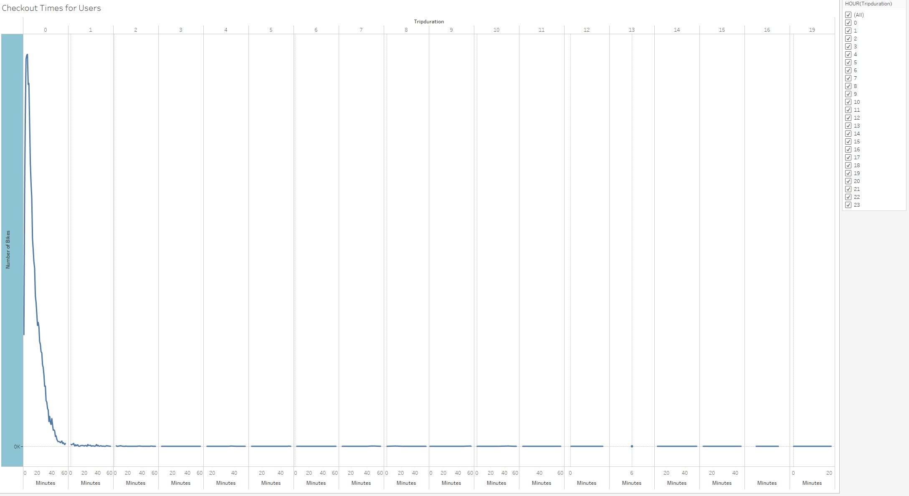
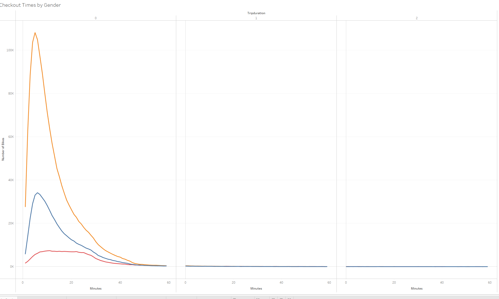
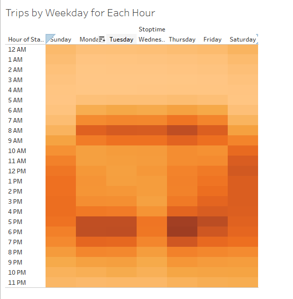
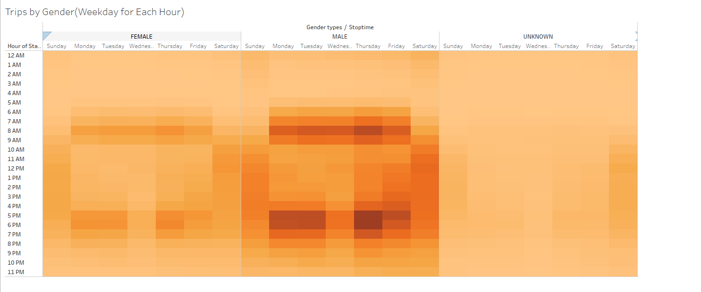
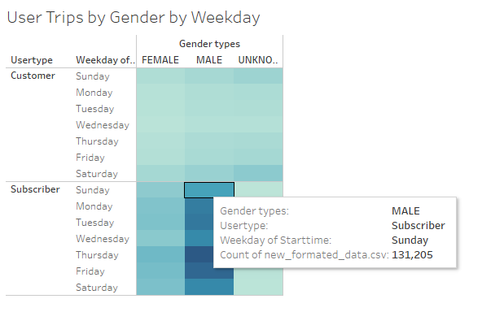
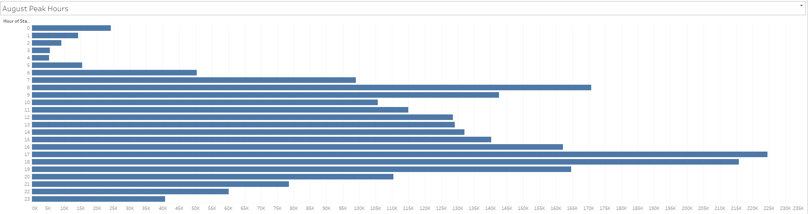
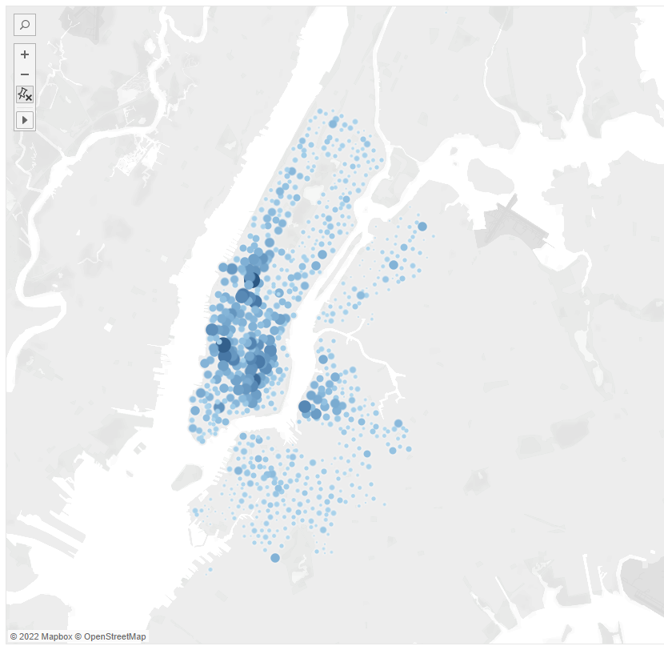

# Bikesharing

## Overview of the analysis:

For this analysis, I use Pandas to change the "tripduration" column from an integer to a datetime datatype. Then, using the converted datatype, create a set of visualizations to:

- Show the length of time that bikes are checked out for all riders and genders
- Show the number of bike trips for all riders and genders for each hour of each day of the week
- Show the number of bike trips for each type of user and gender for each day of the week.
- Finally, you’ll add these new visualizations to the two you created in this module for your final presentation and analysis to pitch to investors.

## Results:
- First I show the checkout times for users for each hour of the day and duration. This will show the amount of bikes compared to the trip time.
  
  
  
-  Then I show the data for the checkout times by gender. This shows that males have a higher rate of checkout than the others.

  
  
  
- I then add the trips by weekday for each hour to show the spead of trips that have happened. This shows the total count of trips for that hour per day.

  
  
- To isolate the data of trips by weekday a little more accurately we spread the datas trips by weekday per gender. This shows that from 7am to 7pm the male population does the most trips from the three data possibilities.

  
  
 
- In this we also want to be able to show the user trips by gender but in two categories as well such as customer and subscriber to be able to see the potential growth.

  
  
  
- To add more data to the story I wanted to add the August peak times to show the best times for preformance and repairs.

  
  
- Finally I think that knowing the best starting location is ideal to tie in the data for where to optimize and maximize business.

  
  
## Summary:

My summary for this analysis would be that the ideal way to optimize business would be to market towards the more female demographic for earlier times of the day such as work hours. As well as making repairs from the time of 2 am to 5 am. The times for the greatest use are from 3pm to 7pm with a constant growth till 7pm.
What I would add to see more data would be to add the station names in the starting locations and end locations to show what the most popular locations would be for repairs and resetting the bikes. The second opinion I have would like to see the age and gender for those using the bikes to give a better demographic of who exactly is using the bikes more in one chart. 

### Dashboard Link:

https://public.tableau.com/views/Challenge_16482566330390/Start?:language=en-US&publish=yes&:display_count=n&:origin=viz_share_link
